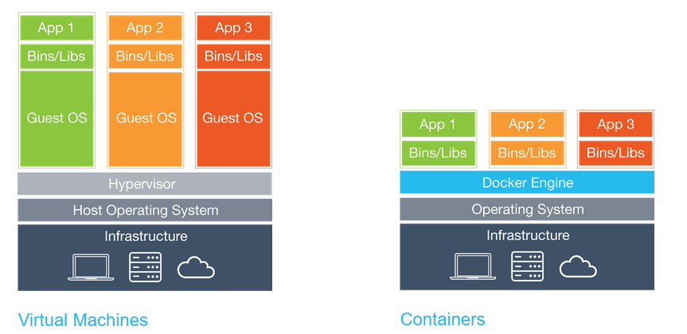

# Qu'est-ce Docker ?

> Docker est un logiciel libre qui automatise le déploiement d'applications dans des conteneurs logiciels1. Selon la firme de recherche sur l'industrie 45 Research, « Docker est un outil qui peut empaqueter une application et ses dépendances dans un conteneur virtuel, qui pourra être exécuté sur n'importe quel serveur Linux ». Ceci permet d'étendre la flexibilité et la portabilité d’exécution d'une application, que ce soit sur la machine locale, un cloud privé ou public, une machine nue, etc.  

> Docker étend le format de conteneur Linux standard, LXC, avec une API de haut niveau fournissant une solution de virtualisation qui exécute les processus de façon isolée. Docker utilise LXC, cgroups, et le noyau Linux lui-même. Contrairement aux machines virtuelles traditionnelles, un conteneur Docker n'inclut pas de système d'exploitation, s'appuyant sur les fonctionnalités du système d’exploitation fournies par l'infrastructure sous-jacente.  

> La technologie de conteneur de Docker peut être utilisée pour étendre des systèmes distribués de façon à ce qu'ils s'exécutent de manière autonome depuis une seule machine physique ou une seule instance par nœud. Cela permet aux nœuds d'être déployés au fur et à mesure que les ressources sont disponibles, offrant un déploiement transparent et similaire aux PaaS pour des systèmes comme Apache Cassandra, Riak ou d'autres systèmes distribués.  

Pour simplifier, docker est un outil permettant la création d'un environnement (appelées conteneurs, *container en anglais*) afin d'isoler des applications pour ne pas en gêner d'autres.
Docker utilise des fonctionnalités natives au noyau linux, comme les cgroups ou les namespaces, mais offres les outils pour le faire de manières simplifiés.

## Conteneurs VS machines virtuelles
Il faut savoir que docker n'a rien inventé, la technologie de conteneurisation existe depuis un moment, notamment avec les *jails (prisons)* sous BSD, les *zones* sous Solaris, même Linux a eu son lot, avec *openvz*, *vserver* ou plus récemment *LXC*.

> Mais en fait, les conteneurs c'est comme les machines virtuelles ?

Oui et non, la finalité est quasiment la même, isoler nos applications. Mais le fonctionnement est totalement différents.

Pour une machine virtuelle, vous créez comme son nom l'indique, une machine virtuelle, c'est à dire, vous lui indiquez la ram à utiliser, le nombre de cpu, et vous créé un disque dur virtuel pour installer un OS. Votre machine dispose de ces propres ressources.

Pour les conteneurs c'est différent, on n'installe pas d'OS à proprement parlé, mais un rootfs (le / d'un unix/linux) qui est appellé image, qui contient les librairies et les binaires nécessaires. Le noyau quand à lui, est partagé avec le système hôte. Nous pouvons évidemment limiter les ressources des conteneurs.

Voici une image illustant la différence entre VM et Docker :  

  

Machines Virtuelles et Conteneurs ont leurs avantages et bien évidemment leurs inconveniants. Par exemple lancer ou créer un conteneur, est vraiment plus rapide que lancer une VM. Mais une VM offre une meilleur isolation.
Le plus gros défaut des conteneurs, c'est le fait que ce n'est pas *cross-platfrom*. On lance des conteneurs Linux sous Linux, des conteneurs BSD sous BSD ou des conteneurs Windows sous Windows (cela arrive avec windows 2016).

## Docker, pour quoi faire ?!
Docker a plusieurs cas d'utilisation.

* Le déploiement :
Puisque docker à pour vocation de conteneuriser des applications, il devient simple de créer un conteneur pour notre application, et la dispatcher où bon vous semble.
* Le développement :
Cela permet de facilement avoir le même environnement de developpement qu'en production, si ça marche quelques part, ça marchera partout. Cela permet également de pouvoir sur la même machine, tester avec plusieurs versions d'un même logiciel. Par exemple pour une application php, ou pourrais facilement tester sur plusieurs version de php, puis plusieurs version de nginx et d'autre serveur web.
* Installer des applications :
Etant donnée que docker propose une multitude d'outils, vous allez voir à quel point il est facile et rapide d'installer une application, bien souvent une seul ligne de commande suffit pour avoir par exemple notre owncloud fonctionnel.
