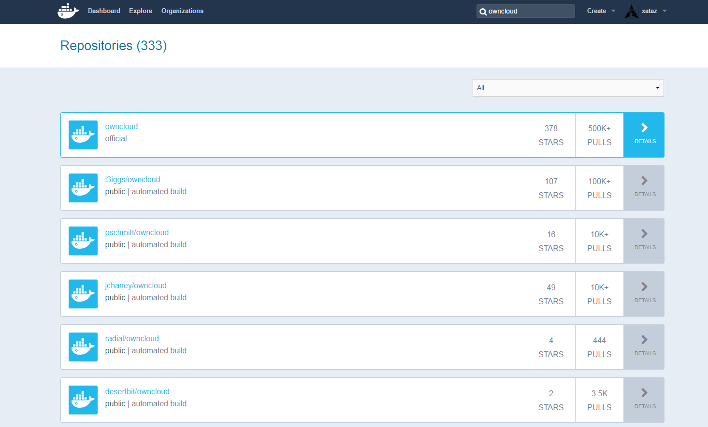
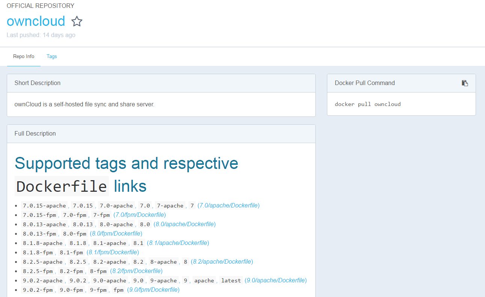

# Le docker Hub

## Qu'est ce que le docker hub
Le docker Hub est un store ou les utilisateurs de docker peuvent partager leur images. Les images de base ont été créé par l'équipe de docker.
Il est accessible ici :
[https://hub.docker.com/explore/](https://hub.docker.com/explore/)

Ceci fait partie des forces de docker, beaucoup d'images sont disponibles (peut être même trop), allant d'une simple debian, à une debian préconfigurer pour owncloud par exemple.
C'est justement cet méthode que j'appelle la méthode feignasse ^^. Je veux owncloud, je télécharge l'image et je crée un conteneur, vu que j'ai une bonne connexion, en 1 minute max, j'ai un owncloud fonctionnel, elle est pas belle la vie ?!

Aucun compte n'est nécessaire pour télécharger une image, mais bien évidemment pour pouvoir envoyé vos images, il faut un compte.


## Chercher une image
Il existe 2 méthodes de chercher sur le Hub, la première par le site web.
Gardons mon exemple, je veux un owncloud.
Sur le site je cherche donc owncloud, et j’obtiens plusieurs résultat :


Nous avons donc plusieurs résultat, avec plusieurs information ;
Le nom de l'image => Généralement sous la forme USER/IMAGE_NAME, sauf dans le cas d'une image officiel, ou c'est seulement IMAGE_NAME
Le nombre de stars => Le système de notation
Le nombre de pulls => Le nombre de téléchargement

On en choisi l'officiel.
Nous allons avoir plusieurs informations :


L'onglet Repo Info est divisé en trois partie.
La première est une description brève de l'images.

Sur la droite, nous avons la commande qui permets de la télécharger :
```shell
docker pull owncloud
```

Puis dans le corps, plusieurs informations sur l'image, les versions des applications par exemple, puis souvent, les commandes/variables pour lancer un container avec cette image, par exemple ceci :
```shell
docker run -d -p 80:80 owncloud:8.1
```
Ceci lance le conteneur et rends accessible l'application sur le port 80, on verra ceci tout à l'heure.


Dans l'onglet Tags, se sont les numéro de tags disponible, souvent apparenté au numéro de version de l'application.

Nous avons parfois deux autres onglets, Dockerfile et Build Details. Ces onglets apparaissent quand les images sont "autobuildé" par le dockerhub, et donc il s'agit de la "recette" de l'image, c'est le fichier qui a permit de la construire. Nous verrons ceci plus loin dans le tutoriel. Autrement nous avons Build Details, qui permets de voir quand et comment c'est passer les contructions de l'image.


Autre possibilité pour trouver une image, en ligne de commande avec docker :
```shell
$ docker search owncloud
NAME                       DESCRIPTION                                     STARS     OFFICIAL   AUTOMATED
owncloud                   ownCloud is a self-hosted file sync and sh...   310       [OK]
l3iggs/owncloud            The very latest ownCloud server release, a...   104                  [OK]
jchaney/owncloud           ownCloud 7 on Nginx                             48                   [OK]
pschmitt/owncloud          Reasonably configurable Docker image for t...   15                   [OK]
dperson/owncloud                                                           9                    [OK]
radial/owncloud            Spoke container for Owncloud, an open sour...   4                    [OK]
webdeskltd/owncloud        ownCloud based on opensuse Run: docker run...   3                    [OK]
desertbit/owncloud         Deploy the latest ownCloud on Debian 8 wit...   2                    [OK]
mikewhy/owncloud           Pain free recent version of ownCloud            1                    [OK]
actualys/owncloud          Owncloud                                        1                    [OK]
dinkel/owncloud            ownCloud running on Nginx with data persis...   1                    [OK]
splattael/owncloud         ownCloud/MySQL on Alpine (image size: 98 MB)    1                    [OK]
martingabelmann/owncloud   Dockerized OwnCloud based on l3iggs/archli...   1                    [OK]
aheimsbakk/owncloud-apcu   ownCloud Docker with APCu enabled               1                    [OK]
d4v1d31/owncloud           Simple OwnCloud container based on alpine ...   1                    [OK]
webhippie/owncloud         Docker images for owncloud                      0                    [OK]
derjudge/owncloud          Arch Linux based ownCloud server                0                    [OK]
cloyne/owncloud            OwnCloud Docker image.                          0                    [OK]
gnarea/owncloud            Lightweight Docker image for ownCloud v8        0                    [OK]
jangmarker/owncloud        based on the official owncloud build, incl...   0                    [OK]
corexx/owncloud            ownCloud running in docker container.           0                    [OK]
inox42/owncloud            owncloud                                        0                    [OK]
gymnae/owncloud            Alpine:edge based owncloud 9 image              0                    [OK]
kampka/owncloud            An owncloud image build on top of arch linux    0                    [OK]
jgkamat/owncloud           A small owncloud repostiory                     0                    [OK]
```

Nous avons par contre ici beaucoup moins d'information, personnellement j'utilise cette méthode que pour rechercher des images de base (debian,centos,fedora etc ...).

